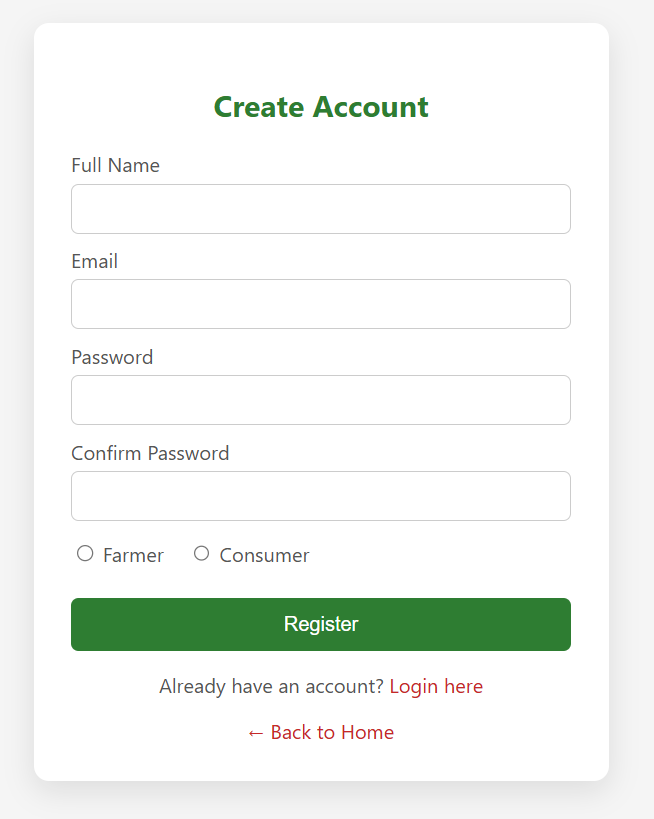
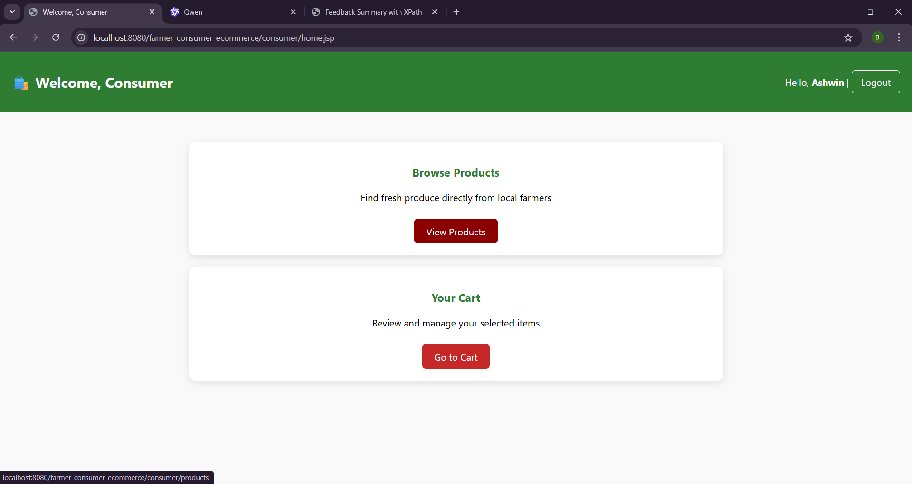

# 🌾 Farmer–Consumer E-Commerce Web Application

A full-stack Java web application connecting farmers directly with consumers. Farmers can register, manage products, view orders, and respond to consumer messages. Consumers can browse products, add to cart, place orders, and communicate with farmers. Built using **JSP**, **Servlets**, **MySQL**, and **AJAX**.

---

## 📷 Screenshots

### Home Page

### Registration Page

### Login Page

### Farmer Dashboard

### Add Product

### Orders

### Messages

### Consumer Dashboard

### Consumer Product Listing

### Cart

### checkout

---

## 🧭 Project Overview

The **Farmer–Consumer E-Commerce Application** is designed to provide a seamless platform for farmers and consumers to interact and trade directly. The system ensures fair pricing, real-time messaging, and easy product management while providing a user-friendly interface.

---

## ⚙️ Features

### 👨‍🌾 Farmer Module
- Register and login  
- Add, edit, and manage products  
- View orders and messages from consumers  
- Real-time message updates using **AJAX**  

### 🛒 Consumer Module
- Register and login  
- Browse products from all farmers  
- Add products to cart and checkout  
- Send messages to farmers directly from product pages  

### 💻 Common Functionalities
- Role-based authentication and session management  
- Dynamic JSP pages for interactive content  
- Asynchronous updates using **AJAX & XML**  
- Secure database operations with DAO pattern  

---

## 🧩 Technologies Used

### Front-End
- HTML5, CSS3  
- JavaScript & AJAX (XMLHttpRequest)  
- JSP for dynamic page rendering  
- XML for message data exchange  

### Back-End
- Java Servlets  
- MySQL Database  
- Apache Tomcat Server  

### Testing
- Selenium WebDriver  
- Manual Testing  
- Browser Compatibility Testing  

---

## 🧱 Architecture

- **JSP pages** handle user interaction and display dynamic content.  
- **Servlets** process requests, validate inputs, and interact with the database.  
- **AJAX & XML** enable real-time message updates without page reload.  
- **MySQL** stores all user, product, order, and message data.  
- Follows an MVC-like design for scalability and maintainability.  

---
